  

# ⚡ Awesome Cloud Data Warehouse 🚀

  
  
  
  
  
  

---

> **Curated List of SaaS Platforms & Open-Source GitHub Projects**
> 
> *Focused on Cloud Data Warehouses, Lakehouses, MPP Query Engines & Real-Time Analytics Databases*
> 
> 📅 **Last updated: October 2026**

---

## 💡 Overview & SEO Context

This repository tracks top-tier **SaaS platforms**, **cloud-native lakehouses**, and **open-source OLAP engines** in the **Cloud Data Warehousing (CDW)** ecosystem. Modern enterprise architectures rely on these tools for high-throughput columnar storage, Massively Parallel Processing (MPP), and decoupling compute from storage to power real-time business intelligence (BI), AI/ML feature stores, and interactive dashboards.

**Key Categories Covered:**
- ☁️ **Commercial Cloud Data Warehouses & Lakehouses** (Snowflake, Databricks, BigQuery, Redshift, Synapse)
- 🔓 **Open-Source Real-Time OLAP Databases** (ClickHouse, DuckDB, Apache Doris, StarRocks, Pinot, Druid)
- 📜 **Open Lakehouse Table Formats & Engines** (Apache Iceberg, Delta Lake, Trino, Apache Hudi, Apache Spark)

---

## 📖 Table of Contents

- [☁️ SaaS & Hosted Platforms](#️-saas--hosted-platforms)
- [🔓 Open-Source GitHub Projects](#-open-source-github-projects)
- [🤝 How to Contribute](#-how-to-contribute)
- [☕ Support & Community](#-support--community)
- [⚠️ Disclaimer](#️-disclaimer)
- [📈 Star History](#-star-history)

---

## ☁️ SaaS & Hosted Platforms

> **📊 Market Context & Concentration**: The global cloud data warehouse market is valued at **~$36 Billion in 2026**, projected to reach **~$95 Billion by 2032** at a **17.5% CAGR**. The sector is **moderately concentrated** at the top tier—dominated by cloud hyperscalers (AWS Redshift, Google BigQuery, Azure Synapse) and independent market leaders (**Amazon**, **Alphabet**, **Microsoft**, **Databricks** with **$7B+ ARR**, and **Snowflake** with **$4.68B FY2026 revenue**). The remaining market is distributed across specialized high-performance platforms (ClickHouse Cloud, Teradata Vantage, Firebolt, Yellowbrick, Panoply).

*Sorted by Company Size / Valuation / Revenue (Descending):*

| Platform | Description | Pricing (Starting Tier) | Free Tier Limits | Company Size / Valuation |
|:---|:---|:---|:---|:---|
| **[Amazon Redshift](https://aws.amazon.com/redshift/)** | AWS's petabyte-scale data warehouse with RA3 instances and Redshift Serverless. | **Redshift Serverless**: **$1.50/hour** (starting). **Provisioned (RA3)**: **$0.543/hour** (starting). **Managed Storage**: **$0.024/GB/month**. | **AWS Free Tier**: **$300 credits** for new accounts. **2-month free trial** for Redshift Serverless (up to $300 credit). | **~$638B Revenue** (Amazon FY2025) |
| **[Google BigQuery](https://cloud.google.com/bigquery)** | Google's serverless, multi-cloud data warehouse with built-in ML and BI Engine. | **On-demand**: **$6.25/TiB scanned** (first 1 TiB free monthly). **Capacity (slots)**: **$0.04/slot-hour** (1-year commitment). | **Google Cloud Free Tier**: **$300 credit for 90 days**. **Always Free**: **1 TiB queries/month** & **10 GB storage/month**. | **~$350B Revenue** (Alphabet FY2025) |
| **[Azure Synapse Analytics](https://azure.microsoft.com/en-us/products/synapse-analytics/)** | Microsoft's unified analytics service combining data warehousing and big data analytics. | **DW100c**: **~$1.10/hour** (~**$800/month**). **DW1000c**: **~$11.11/hour** (~$8,000/month). | **Azure Free Account**: **$200 credit for 30 days** + **12 months of select free services**. | **~$281B Revenue** (Microsoft FY2025) |
| **[Databricks SQL](https://www.databricks.com/)** | Lakehouse SQL warehouse built on Apache Spark with Photon engine. | **SQL Serverless**: **$0.70/DBU** (includes cloud instance cost). **SQL Classic**: **$0.55/DBU**. | **14-day free trial** with full platform access. No perpetual free tier. | **$100B+ Valuation** ($7B+ Annualized Revenue) |
| **[Snowflake](https://www.snowflake.com/)** | Cloud data warehouse with separate compute/storage, data sharing, and Snowpark. | **Standard**: **$2.00/credit** (AWS US East). **Enterprise**: **$3.00/credit**. | **$400 free trial credits** for 30 days. No perpetual free tier. | **~$65B Market Cap** ($4.68B FY2026 Revenue) |
| **[ClickHouse Cloud](https://clickhouse.com/)** | Managed version of ClickHouse. Sub-second queries on billions of rows. | **Basic**: **~$66.52/month** (6 hrs/day active, 1TB storage). **Scale**: **$0.2985/unit/hour**. | **$300 free credits** for 30 days. Basic tier includes 6 hrs/day active compute. | **$15B Valuation** ($250M ARR) |
| **[Teradata Vantage](https://www.teradata.com/)** | Enterprise data warehouse with VantageCloud Lake consumption pricing. | **VantageCloud Lake Standard**: **$4.80/hour** (2-node Small cluster). **Enterprise**: **$9,000/month**. | **Free trial available** (requires sales contact). No perpetual free tier. | **~$1.8B Revenue** |
| **[Firebolt](https://www.firebolt.io/)** | Cloud data warehouse optimized for sub-second analytics on massive datasets. | **Managed Service / BYOC**: Consumption-based pricing starting at **$0.47/node-hour**. | **$200 free credits** for new users upon signup. | **~$269M Raised** (Private) |
| **[Yellowbrick](https://www.yellowbrick.com/)** | Data warehouse for hybrid cloud and on-premises deployments. Kubernetes-native. | **On-Demand**: **$0.28/vCPU/hour** (per-second metering). **1-Year**: **$613/vCPU/year**. | **Free trial available** (requires sales contact). No perpetual free tier. | **~$243M Raised** (Private) |
| **[Panoply](https://panoply.io/)** | Managed data warehouse with built-in ELT & automated schema management. | **Lite**: **$1,558/month** (20M rows/month, 2 TB storage). **Standard**: **$2,498/month**. | **Free Proof of Value** (trial) available. No perpetual free tier. | **Acquired by Google** (2024) |

---

## 🔓 Open-Source GitHub Projects

*Sorted by GitHub Star Count (Descending):*

| Repo | Description | Stars |
|:---|:---|:---:|
| **[Apache Spark](https://github.com/apache/spark)** | Unified engine for large-scale data processing & data lakehouses. Apache-2.0. |  |
| **[ClickHouse](https://github.com/ClickHouse/ClickHouse)** | Column-oriented real-time DBMS with vectorized execution. Apache-2.0. |  |
| **[DuckDB](https://github.com/duckdb/duckdb)** | In-process analytical SQL database ("SQLite for Analytics"). MIT. |  |
| **[Apache Doris](https://github.com/apache/doris)** | MPP-based real-time analytics database for fast reporting. Apache-2.0. |  |
| **[StarRocks](https://github.com/StarRocks/starrocks)** | Next-gen MPP database for sub-second analytics. Apache-2.0. |  |
| **[Trino](https://github.com/trinodb/trino)** | Fast distributed SQL query engine for big data federation. Apache-2.0. |  |
| **[Delta Lake](https://github.com/delta-io/delta)** | Storage framework bringing ACID transactions to data lakes. Apache-2.0. |  |
| **[Apache Iceberg](https://github.com/apache/iceberg)** | High-performance open table format for huge analytic datasets. Apache-2.0. |  |
| **[Apache Hudi](https://github.com/apache/hudi)** | Upserts, deletes, and incremental processing on data lakes. Apache-2.0. |  |
| **[Apache Pinot](https://github.com/apache/pinot)** | Real-time distributed OLAP datastore for user-facing analytics. Apache-2.0. |  |
| **[Apache Druid](https://github.com/apache/druid)** | Real-time analytics database designed for fast slice-and-dice queries. Apache-2.0. |  |
| **[Apache Kylin](https://github.com/apache/kylin)** | Distributed analytical engine providing SQL interface and multi-dimensional cubes. Apache-2.0. |  |
| **[Greenplum](https://github.com/greenplum-db/gpdb)** | Open-source MPP database based on PostgreSQL for analytics & AI. Apache-2.0. |  |
| **[Apache Calcite](https://github.com/apache/calcite)** | Dynamic data management framework & SQL parser powering analytics engines. Apache-2.0. |  |

---

## 🤝 How to Contribute

Contributions are highly welcome! To add or update entries:
1. Fork the repository.
2. Update `README.md` following the exact table formatting (include exact pricing/trial limits or GitHub star badges).
3. Submit a Pull Request detailing your changes.

Check out our curated list collection at [Awesome-Awesome-Awesome](https://github.com/ishandutta2007/Awesome-Awesome-Awesome).

---

## ☕ Support & Community

If you find this list helpful, please consider supporting the project!

- ⭐ **Star** this repository on GitHub
- 📢 **Share** with your data engineering network
- ☕ **Buy me a coffee / Sponsor**: Support ongoing maintenance via [GitHub Sponsors](https://github.com/sponsors/ishandutta2007)

Thank you to all contributors and community supporters! ❤️

---

## ⚠️ Disclaimer

- This is a community-curated reference list for informational and evaluation purposes.
- All pricing and company size metrics are retrieved from verified public disclosures and vendor documentations but are subject to change. Always consult vendor pricing pages for formal production quotes.

---

## 📈 Star History

